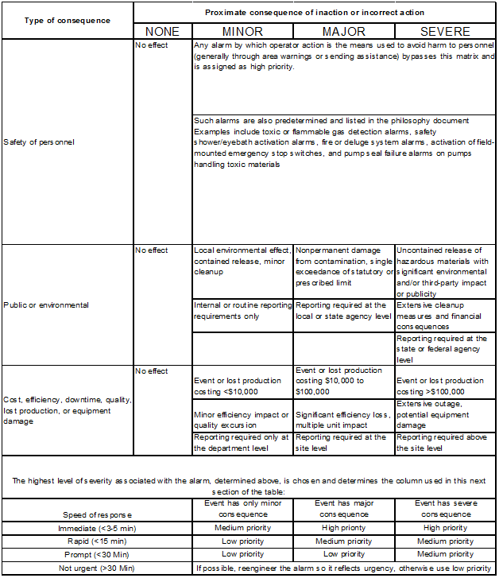
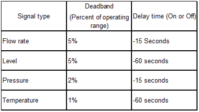
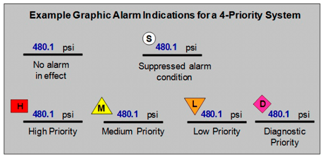

# Документ методології тривог. Загальне.

В ISA-18.2 стверджується, що **документ методології тривог** документує цілі функціонування системи тривожної сигналізації і методи досягнення цих цілей. Він починається з основних означень і розширює їх до потрібних функцій. На основі завдань, означень і принципів визначаються необхідні пріоритети тривог, класи, показники продуктивності, граничні показники продуктивності та вимоги до звітності. Означуються не тільки переліки, але і вимоги щодо відношення тривоги до того чи іншого класу, пріоритету і т.п. У цьому документі також оговорюються схеми індикації тривог за допомогою людино-машинного інтерфейсу, які включають і використання пріоритетів. Документ методології тривог означує процеси, які забезпечують злагоджену організацію функціонування тривог по всьому життєвому циклу системи тривожної сигналізації.

Виділять основні цілі систем тривожної сигналізації, які повинні бути задокументовані в методології тривог:

- безпека, здоров\'я та екологія;

- надійність;

- якість продукції;

- продуктивність (production rate);

- ефективність;

- нормативні вимоги;

- захист обладнання.

Важливо, щоб у документі методології тривог були означені **операційні цілі** та показано за рахунок яких особливостей системи тривожної сигналізації досягаються ці цілі.

Загальною метою системи тривожної сигналізації є спрямування уваги оператора на ненормальні умови функціонування обладнання/заводу, які потребують своєчасного реагування. Під час розробки системи тривожної сигналізації дуже важливо мати конкретне означення поняття «тривоги». Тому перш за все документ методології тривог повинен містити означення тривоги. Багато організацій використовують означення наведене в стандарті ISA-18 2: «це звукові та/або візуальні засоби індикації для оператора про несправність устаткування, відхилення від процесу, ненормальні умови, які потребують своєчасного реагування.» Однак деякі організації можуть включати додаткові деталі, враховуючи свої специфічні ознаки. В такому випадку у визначення повинні бути включені такі аспекти:

а) означені типи подій;
б) порогові значення або класифікатори, типові для подій, які класифікуються як тривожні;
в) механізм оповіщення.

До прикладів подій, які можуть класифікуватися як тривожні належать:

а) ненормальні умови, що можуть спричинити небезпечну ситуацію або згортання виробництва;\
б) відхилення процесу, які можуть призвести до проблем пов'язаних з якістю продукції;\
в) несправності обладнання.

Частина означення «тривоги» повинна бути присвячена, конкретизації персоналу, на котрий орієнтована система тривожної сигналізації. Зазвичай цільовим персоналом виступають оператори, але для деяких об\'єктів можуть бути обрані інші кадрові групи. Якщо це так, це повинно бути зафіксовано в документі методології тривог.

Приклади критеріїв, які означують події як тривожні:

1.  Кожна тривога вимагає «показової» (явної) реакції оператора, яка допомагає уникнути або пом'якшити небажані наслідки.

2.  Деякі обґрунтовані відповіді оператора:

    1.  вносити зміни до процесу шляхом впливу системи керування;

    2.  доручати іншим вносити зміни в систему керування (вручну запускати насоси, керувати клапанами, перевіряти функціональні елементи, реєструвати на технічне обслуговування та ін.);

    3.  зв'язуватися з іншими людьми або функціональними групами щодо ситуації для своєчасного вирішення.

3.  Деякі приклади відповідей операторів, яких може бути недостатньо, щоб відповідати означенню тривоги:

    1.  записувати щось у журнал (наприклад, інформацію про ремонт);

    2.  приймати рішення приділяти більше уваги процесу;

    3.  усвідомлювати те, що наступна зміна може зіштовхнутися з якоюсь проблемою.

4.  Тривоги повинні передавати відчуття терміновості та вказувати на ситуації, що вимагають відносно швидкої реакції оператора, порядку хвилин, а не годин.

5.  З моменту оповіщення про тривогу до безповоротних наслідків повинно бути достатньо часу, з метою надання можливості оператору внести відповідні коригувальні дії. Якщо цього часу недостатньо, тоді атрибути тривоги слід переглянути та внести корективи. Інший варіант в такому випадку - це додати ще одну (кілька) додаткову тривогу, яка буде попереджати оператора про потенційні наслідки при цьому надаючи оператору достатньо часу для реагування.

6.  Тривоги повинні вказувати на ненормальні, а не на звичайні ситуації. \"Час взяти пробу 16:00\" - це приклад нормальної ситуації, яка не повинна алармуватися.

7.  Подія або умова, яка виступає класифікатором тривоги є унікальною (тобто, не дублює умову іншої тривоги).

Означення тривоги наведене у стандарті включає опис механізму оповіщення, тип подій, класифікатори подій та цільовий персонал. Слід звернути уваги на те, що сповіщення, які не вимагають коригувальних дій оператора не повинні бути сконфігуровані як тривоги. Прикладом таких тривог є сповіщенння пов\'язані з технічним обслуговуванням від діагностики обладнання, які не вимагають негайної реакції оператора.

В документі методології тривог необхідно описати автомат станів, який буде використовуватися в системі тривожної сигналізації. Також необхідно додати інформацію стосовно пріоритетів: яка кількість та як вони будуть називатися (високий, середній, низький пріоритети). Стандарт та інші гайди такі як EEMUA 191 не рекомендують використовувати більше 4-ч пріоритетів. Найчастіше найвищий з цих пріоритетів зарезервований для дуже малої кількості обраних тривог.

Документ методології тривог повинен включати означення класів тривог.

Організація системи тривожної сигналізації -- це мультидисциплінарна та неперервна діяльність . Для забезпечення оптимального функціонування системи неможливо обійтися підтримки з боку персоналу експлуатації, технічного обслуговування, інженерії та іншого. Тому дуже важливо означувати ролі та відповідальності залученого персоналу, щоб кожен був обізнаний про діяльності, які закріплені за персоналом.

Зазвичай до організації системи тривожної сигналізації залучені такі групи персоналу:

- оперативний персонал (оператори, головні оператори, керівники змін);
- власник системи (група персоналу, яка здійснює підтримку системи. В документі методології тривог повинно бути чітко написано, яка група персоналу є власником системи тривожної сигналізації та відповідає за всі процеси організації функціонування системи);
- персонал, відповідальний за розроблення та функціонування системи керування (інженери АСКТП, інженер КІП (КІПовець), інженер технічної підтримки з інформаційних та серверних технологій);
- технологи;
- персонал технічного обслуговування;
- начальник дільниці (цеху, робочої комірки);
- проектний персонал (проектні інженери та менеджери проекту);
- персонал з охорони праці, охорони здоров\'я та навколишнього середовища (керівник служби безпеки);
- навчальний персонал (керівний інструктор);
- сторонній персонал (постачальники послуг з організації систем тривожної сигналізації та вендори);
- ліцензіари
- персонал з контролю якості;
- підрядники або будь-який будівельний/сервісний персонал, що бере участь у роботі заводу.

**Приклади ролей та відповідальностей:**

- розроблення методології системи тривожної сигналізації;
-  ідентифікація тривог;
- надання допомоги під час раціоналізації та пріоритизації тривог; 
- здійснення раціоналізації/налаштування тривог;

- перегляд та внесення пропозицій щодо покращення функціонування тривог;

- надання дозволу на вдосконалення системи тривожної сигналізації та контрольно-вимірювальних приладів;

- впровадження вдосконалення системи тривожної сигналізації та контрольно-вимірювальних приладів

- тестування тривог;

- проведення оцінювання функціонування системи тривожної сигналізації та розроблення рекомендацій;

- проведення аудиту системи тривожної сигналізації та розроблення рекомендацій;;

- розроблення та впровадження показників функціонування системи тривожної сигналізації;

- перевірка ефективності за показниками функціонування системи;

- впровадження рекомендацій аудиту;

- розроблення та перевірка операційних процедур;
- розроблення методики підготовки експлуатації тривог та системи в цілому;

- завершення підготовки експлуатації тривог та системи в цілому;

- обслуговування (підтримка)ведення журналів тривог та хронології тривог;

- обслуговування головної бази даних тривог;

- загальні випадки проектування обладнання (попередньо визначені тривоги);

- організація та регулярне обслуговування системи;

- вирішення проблем системи;

- дослідження відхилень у процесі, для яких існують записи тривог, особливо тих що стосуються охорони здоров\'я, безпеки, навколишнього середовища та якості продукції;

- періодичний перегляд/оновлення документа методології тривог;

- документування результатів раціоналізації та проведення проектних заходів;

- документування результатів тестування тривог;

- документування матеріалів для підготовки персоналу до експлуатації системи;

- періодичний аудит системи.

**Документація системи тривожної сигналізації**

Документування розроблення, а також поточних показників функціонування системи може бути важливими для задоволення зовнішніх нормативних вимог або внутрішніх вимог організації. Документ методології тривог для конкретного об'єкта повинен чітко означувати вимоги до документації, включаючи терміни зберігання, обслуговування, рівні доступу та контроль змін, пов\'язані з документацією. Приклади елементів, які можуть бути задокументовані:

-   Документ методології тривог;

-   Головна база даних тривог;

-   Звіти про ефективність системи тривожної сигналізації;

-   Записи про підготовку персоналу (навчання);

-   Записи про тестування тривог;

-   Періодичний аудит;

-   Журнали тривог;

-   Специфікації технічних вимог системи тривожної сигналізації;

# Документ методології тривог. Ідентифікація.

Ідентифікація тривог – це процес ідентифікації потенційних тривожних умов, для розгляду під час раціоналізації. Проведення ідентифікації необхідною умовою успішної раціоналізації, особливо коли існує значна кількість потенційних тривог.

Процес визначення потенційних сигналів тривоги повинен бути всеохоплюючим і задокументованим у документі методології тривог. Головна база даних тривог (master alarm database, MADB) є необхідним елементом ISA-18.2 і може використовуватися для документування потенційних сигналів тривоги. Для нової системи список потенційних тривог (ім'я тегу, діапазон значень, одиниці вимірювання, тип тривоги та подібні атрибути) може виступати початковим варіантом головної бази даних тривог.

Цей пункт документа методології тривог повинен містити:

-   Джерела потенційних тривог;

-   відповідний метод ідентифікації та методика запису потенційних тривог;

-   рекомендований формат документування ідентифікованих тривог.

Кілька загальних джерел, які можна використовувати для ідентифікації потенційних тривог:

-   Дослідження, пов\'язані з безпекою, такі як аналіз небезпек технологічного процесу (Process Hazards Analysis, PHA), Layer of Protection Analysis. Hazard and Operability Analysis, Safety Requirements Specification, and Failure Modes and Effects Analysis;
-   Нормативні вимоги, такі як дозвіл на викиди або параметри якості;
-   Технологічна документація, така як діаграми технологічного процесу (PFD), діаграми трубопроводів та контрольно-вимірювальних приладів (P&ID), описи процесів та пакети ліцензіарів;
-   операційні процедури, результати розслідування інцидентів або інші вимоги на заводу до тривог;
-   аналізи чи звіти про інциденти;
-   рекомендації виробника обладнання;
-   бази даних тривог, як вони налаштовані в існуючій системі керування (наприклад, для міграції системи на нову платформу або для задоволення додаткових нормативних вимог).

# Раціоналізація

Раціоналізація це процес гарантування того, що тривоги відповідають означенням та вимогам, які викладені в документі методології тривог. Вона включає обґрунтування, визначення пріоритетів, визначення параметрів та документування. Цей пункт документа методології тривог повинен включати:

а) методи раціоналізації, що використовуються (наприклад, визначення пріоритету, визначення уставок або логічного стану, визначення класу);

б) вказівки щодо визначення відповідності потенційних тривог документу методології тривог;

в) склад команди з раціоналізації, включаючи ролі та досвід, необхідні для виконання завдання;

г) підхід до обробки результатів раціоналізації;

д) вимоги до документації, яка є результатом раціоналізації.

В документі методології тривог зазначаються всі учасники, залучені до процесу раціоналізації. Учасники повинні представляти наступні функції:

-   операційні (наприклад, оператори, технологи, керівники змін);

-   процесна інженерія;

-   системна інтеграція, КІП;

-   інші функції (якість, навколишнє середовище, безпека, надійність).

В документі методології тривог повинно означуватися документація як результат стадії раціоналізація.

Приклад опису документації у документі методології тривог:

а) ідентифікація тегів системи керування, пов\'язана з сигналом тривоги;\
б) потенційна причина тривоги;\
в) тип тривоги (наприклад, високий рівень технологічної змінної, швидкість зміни значення технологічної змінної);\
г) дія оператора;\
д) час, доступний оператору для реагування на тривогу;\
f) наслідок бездіяльності або неправильної дії;\
ж) класифікація тривоги;\
h) значення уставки тривоги або логічний стан (наприклад, \"спрацьовування обладнання активовано\");\

*i) пріоритет тривоги, що виникає в результаті завдання пріоритетності;
j) потреба у вдосконаленій техніці поводження з тривожними сигналами, якщо це необхідно, режимах роботи, для яких будильник дійсний (наприклад, тривога потрібна лише або відрізняється залежно від поточного режиму роботи);
k) інші застосовні довідкові документи.*

**Пріоритизація**

Пріоритет тривоги допомагає оператору у виборі порядку реагування на тривогу в ситуації з декількома сигналами тривоги. Пріоритетність сигналізації є одним із завдань, що виконуються на етапі раціоналізації життєвого циклу системи тривожної сигналізації. Цей пункт в документі методології тривог повинен включати:

а) методика визначення пріоритетності, яку слід використовувати;

б) матриця пріоритетів тривог, якщо потрібно;

в) вказівки щодо тривог, які можуть спричинити можливі дії, пов\'язані з безпекою;

г) обробку поширених типів тривог, таких як тривоги різних приладів діагностики;

д) рекомендований анонсований розподіл пріоритету тривоги

Приклад використання трьох (3) пріоритетів тривожної сигналізації:

Високий = \~ 5%; Середній = -15%; Низький = -80%

Приклад використання чотирьох (4) пріоритетів тривоги:

Найвищий (\<1% або менше -20 таких налаштованих сигналів тривоги);

Високий = -5%; Середній = -15%; Низький = -80%.

**Таблиця 1. Опис пріоритетів**

 

**Визначення уставки тривоги**

Уставки тривог зазвичай визначаються персоналом відповідальним за відповідну виробничу ділянку, той хто добре обізнаний про технологічні змінні процесу та технологічний процес і функціонування обладнання. Цей пункт документа методології тривог повинен включати наступне:

а) методи визначення уставок тривог (тобто динаміка процесу, перевірка історії процесу, близькість до налаштувань блокування);\
б) критерії визначення уставок тривог (наприклад, характер дій реагування та час, необхідний для виконання цих дій).

# Alarm design

Для досягнення послідовності на стадії робочого проектування документ методології тривог повинен означувати рекомендовані значення та/або правила визначення зони нечутливості тривог, часу спрацювання та вимкнення тривог.

**Таблиця 2. Рекомендовані значення зони нечутливості та часу затримки на спрацювання та вимкнення тривог**

 

Починати з 0% зони нечутливості тривоги не рекомендується, оскільки це неодмінно спричинятиме помилкове спрацювання тривоги. В документі методології тривог може бути корисним доповнити ці значення за замовчуванням важливими винятками та відомими спеціальними міркуваннями або умовами. Також може бути корисним документувати процедури перегляду початкових значень та коригування їх за необхідності після значного досвіду експлуатації.

**Реалізація типів тривог**

Багатьох потенційних проблем з тривогами можна уникнути, якщо вибрати правильний тип тривоги для виявлення ненормального стану. Методологія тривог повинна документувати рекомендації щодо використання та міркування щодо дизайну для конкретних типів тривог (наприклад, тривоги із защіпкою) або застосувань, що часто зустрічаються (наприклад, пожежна тривога). Послідовність в alarm design покращує здатність оператора визначати, що відбувається, і збільшує ймовірність правильної реакції. Оператори повинні пройти навчання щодо означення типів тривог, що використовуються в системі.
**Діагностичні тривоги**
Прикладом діагностичної тривоги є тривога недостовірності даних. Для типів тривоги в документі методології тривог повинні бути записані певні судження. Для такого типу як приклад можно виділити судження щодо пріоритету. Отже, одним з прикладів
# HMI design guidance
## Відображення стану тривог в HMI
Відповідне використання кольору, тексту та елементів є важливим засобом, який допоможе оператору виявити наявність тривоги та визначити порядок реагування.
Стандарт ISA-18.2 не вимагає використання певних кольорів для відображення умов тривог. Підходи до індикації можуть відрізнятися в залежності від галузі та регіону. Незалежно від обраної кольорової гами, важливо, щоб кольори, які використовуються для сигналізації, були логічними, відображали пріоритет тривоги та були унікальними (не використовуються для інших цілей, крім сигналізації). Важливо, щоб для індикації стану тривоги використовувалися не тільки колір, але й символи, додаткові елементи та/або текст. Тільки колір не повинен використовуватися як єдиний диференціатор важливої інформації про стан, оскільки дальтонізм доволі часто зустрічається.
Щоб забезпечити узгодженість людино машинного інтерфейсу рекомендується, щоб використання кольорів, додаткових графічних елементів, символів та тексту, було означено у документі методології тривог, яка може бути застосована до всіх систем.

 
## Формування повідомлення про аварію
Повідомлення про тривогу – це текст, який зазвичай відображаються поряд із сигналом тривоги на дисплеях тривог, наприклад на дисплеї зведення тривог . Щоб допомогти оператору діагностувати аномалію та сформулювати відповідь, важливо надати продумані повідомлення, які легко зрозумілі оператору та відповідають формату (формулювання, скорочення, написання великих літер, структура тощо). Наприклад, оператори часто більше знайомі з текстовим описом (наприклад, "Температура реактора А"), ніж з назвою тега (наприклад, "TIC-100").
Методологія тривог повинна документувати формат і правила, яких слід дотримуватися для формування ефективних повідомлень про тривоги. Додаткова інформація про зміст повідомлення про тривоги міститься в TR3. Можливості системи керування слід враховувати при визначенні вимог до повідомлень про тривоги.
**Рекомендації щодо створення повідомлень про тривогу наведені нижче:**
- Чітко визначте стан, який виник – Наприклад, "Висока температура реактора 100" набагато інформативніша, ніж "Тривога реактора 100".
- Не дублюйте інформацію, надану іншими полями, що відображаються, такими як пріоритет тривоги, ім'я тегу чи тип тривоги. 
- Використовуйте терміни, з якими знайомий оператор – Слід уникати наукових/технічних термінів або назв виробників, які мають відношення до інженера АСУТП, а не до оператора. Для багатомовних застосунків важливо, щоб терміни були однаково знайомі та точні на всіх підтримуваних мовах.
- Використовуйте абревіатури зі стандартного словника скорочень – Через обмеження символів іноді доводиться скорочувати терміни. Важливо переконатися, що абревіатури для повторюваних термінів типу "Реактор" застосовуються однаково("RX" або "REAC") у кожному випадку.
- Визначте сталу структуру повідомлень – час реакції оператора скорочується за рахунок логічного, повторюваного шаблону, коли відповідна інформація (обладнання, параметр, стан, уставка тривоги, поточне значення тощо) завжди в одному і тому ж місці в межах повідомлення (наприклад, висока температура реактора, низький тиск масла).
- Не розраховуйте на те, що оператор вивчить назви та номери тегів – для ідентифікації сигналу тривоги слід використовувати текстовий опис пристрою чи обладнання та його місцезнаходження (наприклад, насос West Sump або Central Tank Battery) замість D17-101.
- Включіть інформацію про ймовірну причину тривоги та вказівки щодо реагування на тривогу. Зауважте, що деякі системи надають альтернативні поля або області відображення для подання цієї додаткової інформації оператору.
- Перевірте зручність використання під час експлуатації системи на заводі – Наприклад, розмір тексту повинен бути читабельним з нормального положення оператора на АРМ. Якщо оператори повинні встати зі свого місця для читання дисплея, це матиме обмежену ефективність.
## Інструменти для оператора (функції в HMI)
Важливо вказати вимоги, пов’язані з тим, як оператор взаємодіє з функціями системи тривожної сигналізації, наявними в HMI, особливо з тими, що мають особливе значення для підтримки загального підходу до функціонування системи. Нижче наведено приклади вимог, які слід вказати в документі методології тривог:
- чи допустимо підтвердження декількох тривог одночасно;
- які способи фільтрації тривог будуть надані оператору;
- якщо передбачена функція відтермінування тривог, вкажіть, які тривоги можуть бути відтерміновані, порядок відтермінування, кому дозволено блокувати тривоги та максимальний час відтермінування тривог.
## Доступні типи дисплеїв тривог
_Існує багато різних типів сигналів тривоги, які можна надати оператору. Типові дисплеї включають: дисплей зведення тривог, стан тривоги, журнал тривоги, огляд та спочатку тривогу. Філософія сигналізації повинна визначати, які дисплеї потрібні та які спеціальні вимоги до проектування для їх використання. Наприклад, багато засобів вимагають, щоб один або кілька виділених підсумкових дисплеїв сигналів тривоги були доступні оператору постійно. Інший приклад вимагає надання спеціалізованих місцевих панелей для перегляду тривожних сигналів із конкретних одиниць обладнання або систем, таких як пожежа та газ._
## HMI навігація для тривог
Добре спроектований людино-машинний інтерфейс надає операторам кілька способів переходу до джерела тривоги. На навігаційних вкладках (вікнах, кнопках) корисно вказувати стан тривоги, яка активна на відповідних дисплеях. Методологія тривог повинна документувати функції навігації, які повинні бути доступні операторам.
## Процедури реагування на тривогу
Стандарт ISA-18.2 рекомендує, щоб інформація, задокументована під час раціоналізації тривог (такі як **причина, наслідки та дії оператора**), була надана оператору. Постійний доступ (online, електронний) до цієї інформації в контексті події, є більш ефективним, ніж використання паперових документів. Методи полегшення цього обміну інформацією повинні бути означені в документі методології тривог разом з необхідним/очікуваним змістом.
## Інформація про тривогу
Документ методології тривог повинен означувати, як повідомлення про тривоги будуть розподілятися між операторами, коли вони будуть спрямовані на персонал, який не належить до операторів, за яких обставин тривогу слід поширити та методику поширення. Як правило, тривогу слід повідомляти лише оператору, відповідальному за реагування на тривогу. У деяких випадках тривога також може бути корисним попередженням про неминуче порушення умов функціонування для операторів інших виробничих ділянок, щоб вони могли активно реагувати.
**Розподіл тривог**
*У більшості випадків одному оператору присвоюється область контролюючого органу і відповідальність за процес - операційна позиція. На консолі управління, передбаченій для цієї позиції, можна спостерігати і маніпулювати конкретним підмножиною загального процесу, а зазвичай не іншими частинами загального процесу. Сигнали тривоги, оголошені на цій консолі, стосуються цієї робочої позиції, і за кількома винятками, не включають тривоги з інших робочих позицій.
У деяких випадках бажано розширити сферу дії тривожних сигналів, представлених в робочому положенні, особливо коли є процеси, що перебувають вгору та за течією, які контролюються іншими операторами. Деякі тривожні сигнали, що вказують на проблеми в таких об'єктах верхнього або нижнього течії, можуть завчасно попереджати оператора про те, що незабаром можуть виникнути значні зміни цілей управління процесом. Це може бути досягнуто базовою технікою вибору відповідних сигналів тривоги та забезпечення паралельної маршрутизації їх.
Подібні ситуації існують із забезпеченням тривоги на корисних потоках. Хоча вони можуть контролюватися іншими, деякі характеристики (наприклад, низький тиск пари, висока температура охолоджуючої води) можуть впливати на декількох операторів і процесів в одній установці і можуть бути оголошені в декількох різних робочих позиціях.
Деякі об'єкти є безпілотними та контролюються дистанційно. Персонал може бути відправлений до таких місць для діагностики та вирішення проблеми. Можливо, бажано в такі моменти мати можливість легко забезпечувати паралельну маршрутизацію відповідних тривог тимчасово до консолі на віддаленому місці.*
**Поширення пріоритету**
Просунуті методи розподілу тривог
Багато систем управління мають можливість направляти певні вибрані сигнали тривоги не тільки оператору, але й іншому персоналу за допомогою таких методів, як електронна пошта, системи підкачки, текстові повідомлення, функції інтрамережі / Інтернету тощо. Деякі такі способи використання можуть називатися тривожними сповіщеннями. Вони вважаються розширеними методологіями маршрутизації тривоги.
Можливо, бажані механізми підтвердження передачі сигналів тривоги, що передаються загальними носіями. Також може знадобитися метод повторної передачі (іншому персоналу) для невстановлених сигналів тривоги. Однак ці методи можуть також зазнавати невдачі загальної причини.
Є багато причин для здійснення додаткової маршрутизації тривоги. Деякі приклади:
a) Певні тривожні сигнали можуть представляти інтерес для керівництва операцій, персоналу або персоналу, який працює за викликом, на постійній основі. Такі групи можуть не нести відповідальності за реагування на сигнали тривоги, і тому паралельна маршрутизація їх методами різної надійності може бути достатньою.
b) Деякі організації забезпечують постійне висвітлення під час виклику з питань технічних процесів або проблем, де необхідна підтримка для підтримки роботи установки.
c) Централізовані групи або функції компанії можуть з міркувань регуляторного реагування негайно повідомити про певні тривожні сигнали, наприклад, про ті, що вказують на порушення меж викидів.
d) Постачальники або виробники спеціалізованого або складного обладнання можуть бажати віддалено контролювати певні сигнали тривоги, вироблені таким обладнанням, у режимі реального часу.
**Поширення коригуючих дій**
Ескалація відповіді стосується розширення сфери дії осіб, які будуть сповіщені про тривогу. Приклади ескалації відповідей включають сповіщення оператора нижче за течією, що існує швидке порушення процесу, або сповіщення контролюючих та інших операторів, щоб вони могли допомогти у відповіді.
**Тривоги віддалених локацій**
Багато об'єктів контролюються дистанційно або не мають постійного персоналу (безпілотного). Персонал може бути відправлений у такі місця для усунення та / або усунення неполадок. Для цих застосувань може бути корисно надати паралельну маршрутизацію тривожних сигналів до центральної консолі, консолі на віддаленому місці та відповідальній особі. Обережно слід бути обережним при маршрутизації тривог на кілька локацій, щоб чітко визначити первинну відповідальну сторону. Сигнали, які автоматично надсилаються телефоном, пейджером, текстом тощо, можуть бути предметом проблем із доставкою. У цих випадках зазвичай надсилати сигнал іншому оператору, якщо перший не підтверджує його в розумний час. Філософія повинна стосуватися того, як поводитися з невизначеністю доставки та / або як надіслати тривогу іншому оператору, якщо доставка не підтверджена.
Підтвердження сигналізації повинно бути ретельно продумано, особливо якщо сигналізація перенаправляється в декілька місць (наприклад, консоль віддаленої станції, централізована головна контрольна кімната, оператор, що рухається, або оператор за викликом). У багатьох системах бажано, щоб оператор, який першим отримав сигнал, мав змогу визнати тривогу в усьому світі, щоб вона була записана в основній системі і всі місця були оновлені відповідно. Виконання цих вимог може включати попереднє планування як частину проектування сигналізації, і як таке повинно бути зазначено у філософії сигналізації.
**SIS**
For companies that integrate alarms from BPCS and SIS into a common presentation (usually in the BPCS), it is important to specify in the alarm philosophy how the SIS alarms will be handled. Treatment of SIS alarms is dependent on what safety integrity level (SIL) is provided by these alarms. For further guidance on the treatment of SIS alarms, see ISA-84.00.01-2004 Part 1 (IEC 61511 Mod).

Більшість закладів мають різноманітні різні системи управління, упаковані системи та PLC різних виробництв та від різних постачальників. Деякі засоби також використовують аналітичні системи та інші сторонні продукти, які можуть мати окремі можливості незалежної сигналізації.Документ методології тривог повинен означувати політику та вимоги щодо інтеграції інформації про тривоги з різних джерел у загальну систему організації системи тривожної сигналізації.

В системає тривожної сигналізації використовуються гудки та маяки. Документ методології тривог повинен означувати затверджені методи оголошення, кількість різних тонів, спосіб їх використання (наприклад, різний тон для кожного пріоритету та / або місця розташування оператора) та якщо потрібно використовувати конкретні тони.

Слід ретельно розглянути питання про те, коли можна заглушити ріг тривоги, хто може замовкнути його та за яких умов він повинен відновити звучання. Хоча звуковий ріг часто є хорошим способом привернути увагу оператора, він також може стати перешкодою для діагностики та реагування на стан, який спричинив тривогу.

**Прогресивні методи оповіщення про тривоги**
Методологія тривог повинна документувати типи прогресивних методів оповіщення про тривоги, які можуть використовуватися, та будь-які спеціальні процедури, обмеження, особливості HMI, процесу керування змінами (MOC) або навчання, пов'язане із впровадженням та використанням таких методів.
Документ методології тривог повинен означувати, які Прогресивні методи оповіщення про тривоги затверджені для використання. Вони можуть включати:

- Інформаційні зв’язки
б) спочатку тривожна;
- Логічне блокування тривог/ Зміна параметрів
г) тривожна ситуація на базі держави;
д) перенаправлення тривоги;
f) адаптивне тривожне;
g) тривожні сигнали;
h) експертні системи в режимі реального часу.
# Впровадження, експлуатація, обслуговування
Основними діяльностями етапів впровадження, експлуатації та обслуговування життєвого циклу системи тривожної сигналізації є навчання, тестування та керування блокуванням тривог. Терміни проведення заходів та залучений персонал зазвичай різні на різних етапах. Документ методології тривог повинен містити опис деяких ключових елементів цих діяльностей, включаючи:
- операційні процедури;
- навчання, пов’язане з тривогами;
- тестування тривог;
- порядок відтермінування тривог;
- процедура виведення з експлуатації тривоги;
- практики розслідування інцидентів;
- хронологія системи тривожної сигналізації.
## Операційні процедури

